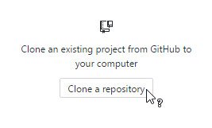
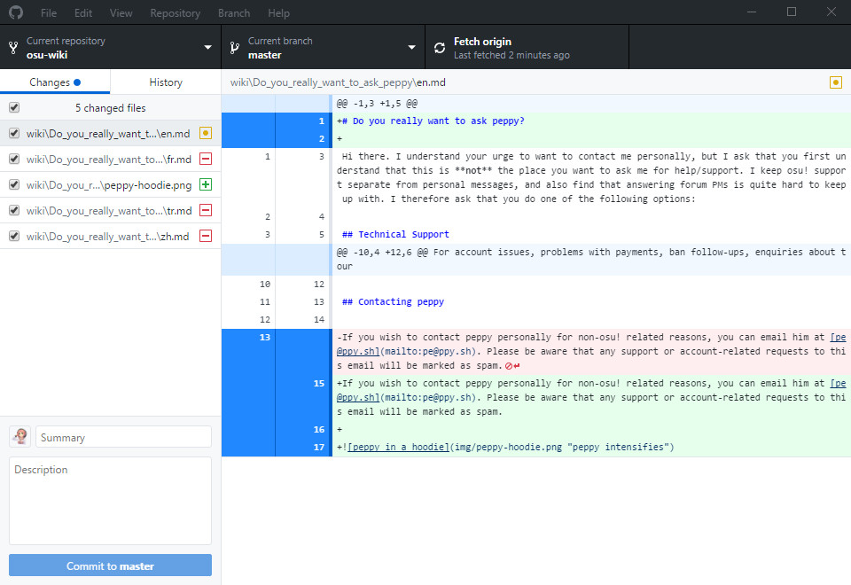

# Locally

*Main page: [osu!wiki Contribution Guide](/wiki/owcg).*

*This article continues from the main page* and assumes that you will be using [GitHub Desktop](https://desktop.github.com). You may use other git clients on your own terms. Even if you do work locally, you will still need to access GitHub to create pull requests to make your changes happen.

## Installing GitHub Desktop

You will need to then install [GitHub Desktop](https://desktop.github.com). See [Getting Started with GitHub Desktop](https://help.github.com/desktop-classic/guides/getting-started/) for help.

When the installer is completed, GitHub Desktop will prompt you to login. Click on the `Sign into GitHub.com` link and enter your GitHub's username (or the email you used) and password. You will then be prompted to configure Git, just fill in the prompts and continue. On the next screen, it will prompt you if you want to submit anonymous usage data, it is your call if you want to opt-out or not.

## Clone

Once you are done setting up GitHub desktop, click on `Clone a repository`.

This will show a list of your repos; select the `osu-wiki` repo. The location of the cloned repo is up to you, but take note as to where you clone it to.

Once you have decided on the clone location, click `Clone`.

## Branching

This step is technically *optional*, but is heavily recommended due to reasons that you will need to look up for yourself.

Click on the `Current branch` dropdown located at the top of the menu.

## Editing

In the folder you cloned the repo into, navigate to the file you want to edit. The articles are organized by the folder names being the article names and the `.md` files being the locales. Once you find the correct file, open it using your favorite text editor.

You can now make your changes. When making changes, try to follow the [Article Styling Criteria](/wiki/ASC) as closely as you can.

## Committing and pushing

Once you are done editing your files, save and go back to GitHub Desktop. It should look something similar to this:

By default, GitHub Desktop will automatically select all of your changes. It is best to separate each "big" action as a single commit. For example, as pictured above, [pippi](/wiki/Mascots/#pippi) had added an image file, modified the `en.md` file to add a title and a link to the image, and deleted the translations. From this, we can have two commits, one for the changes that affected the `en.md` file and one for deleting the translations.

First, pippi will commit changes for the `en.md` and image files by **selecting the files to be committed**. Followed by **entering the commit summary and a detailed description** for the changes that took place.

Once completed, click on the `Commit to` *branch name* button and, if applicable, repeat for the next set of commits you want to do.

Once you have finished making your commits, click on the `Publish branch` button at the top.

## Finishing

You can now go back to [osu!wiki Contribution Guide § Finishing](/wiki/owcg/#finishing) for the last piece of information regarding your pull request and changes.
