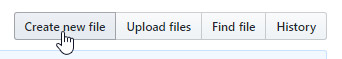

# Online

*Main page: [osu!wiki Contribution Guide](/wiki/owcg).*

*This article continues from the main page.* If you are going to make changes to multiple articles (this includes uploading, deleting, and/or moving images or files), please see the other guide, [osu!wiki Contribution Guide/Locally](/wiki/owcg/Locally).

## Editing

In the [code tab](https://github.com/ppy/osu-wiki), navigate to the file you want to edit. The articles are located in the `wiki` folder and are organized by the folder names being the article names, while the `.md` files are the locales. Once you find the correct file, click on it, then click on the pencil icon.

You can now make your changes. When making changes, try to follow the [Article Styling Criteria](/wiki/ASC) as closely as you can.

### Moving existing files

*Warning: This is **not recommended** because you can only move one file at a time! This may create multiple "dumb" commits that may flag the reviewers into closing or stalling your pull request!*

To move an existing file, click on the pencil icon (similar to editing a file). Above the text editor, there is a path for the file's location. Click on the textbox for the current file.

To change the path, press `Backspace` and repeat until the text box moves back a level. Once you are at the level needed, type in either another folder name and/or the locale name (in lowercase letters) followed by `.md`. To move the file up a level, press `/`.

### Creating new files

When you want to create a new file, click on the `Create new file` button.

This will open the editor. The first thing you will want to do is to enter in the location and file name of the article you are creating. The path must start with `wiki/` followed by the article's title followed by the locale name (in lowercase letters) followed by `.md`.

## Saving and committing

When you are done making changes, scroll down to the bottom of the page. You will see this:

**Whatever you do, never leave the `Update en.md` text box empty!** Instead, enter the article's title and a short summary of all of the changes you made **in English**. You can use the optional description to be more detailed if needed. A good commit may looks something like this:

Preferably, select the `Create a new branch for this commit and start a pull request.` option. This will allow you to make multiple, but different, article changes in the future. You can name this branch to whatever you want, just make sure you note the name you chose.

Once you are done, click on `Propose file change` button. This will do two things, save your changes into the branch you just named and it will open the pull request page.

")

## Finishing

You can now go back to the [osu!wiki Contribution Guide](/wiki/owcg/#finishing) for the last piece of information regarding your pull request and changes.
