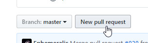

# Online

*Main page: [osu!wiki Contribution Guide](/wiki/owcg).*

*This article continues from the main page.* If you are going to make changes to multiple articles (this includes uploading, deleting, and/or moving images or files), please see the other guide, [osu!wiki Contribution Guide/Locally](/wiki/owcg/Locally).

## Editing

In the code tab, navigate to the file you want to edit. The articles are organized by the folder names being the article names and the `.md` files being the locales. Once you find the correct file, click on it, then click on the pencil icon.

You can now make your changes. When making changes, try to follow the [Article Styling Criteria](/wiki/ASC) as closely as you can.

## Saving and committing

When you are done making changes, scroll down to the bottom of the page. You will see this:

**Whatever you do, never leave the `Update en.md` text box empty!** Instead, enter the article's title and a short summary of **all** of the changes you made. You can use the optional description to be more detailed if needed. A good commit may looks something like this:

Preferably, select the `Create a new branch for this commit and start a pull request.` option. This will allow you to make multiple, but different, article changes in the future. You can name this branch to whatever you want, just make sure you note the name you chose.

Once you are done, click on `Propose file change` button. This will do two things, save your changes into the branch you just named and it will open the pull request page. **Do not enter anything there (this is wrong page).**

## Opening a pull request

Instead, go to the [`ppy/osu-wiki` repository](https://github.com/ppy/osu-wiki) and click on the `New Pull Request` button.

On the next page, if you see these two buttons as pictured below, click the `compare across forks`.

Click on the `head fork` dropdown and select the one with your username (it should be the second one).

Click on the `compare` dropdown and select the one with the branch you had created (this should be listed alphabetically).

Then click on the `Create pull request` button.

Enter the title and fill in the description box. Once you are ready, click the `Create pull request` button.

## Finishing remarks

You can now go back to [osu!wiki Contribution Guide § Finishing remarks](/wiki/owcg/#finishing-remarks) for the last piece of information regarding your pull request and changes.
