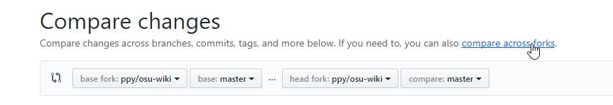
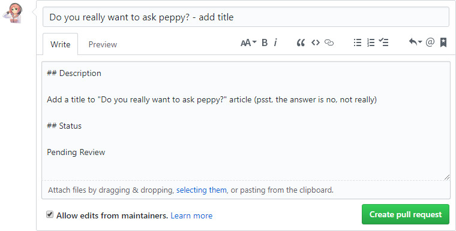

# osu!wiki Contribution Guide

Thanks for your interest in making the osu!wiki better! At this time, contributing to the osu!wiki will require more time and slightly more effort to make your changes actually happen. This quick-start guide is intended for newcomers that have never worked with GitHub and the wiki contribution workflow before. If you already have experience using GitHub, feel free to skip this guide and follow the common feature-branch workflow for content updates in this repository.

If, during any part, you are confused and/or need further help, feel free to send a message to the [osu!dev Discord chat](https://discord.gg/ppy) in the `#osu-wiki` channel.

## Getting started

### Signing up

First, if you don't have a GitHub account, [sign up](https://github.com/join) for one. See [Signing up for a new GitHub account - User Documentation](https://help.github.com/articles/signing-up-for-a-new-github-account/) for help. Then [log in](https://github.com/login) (you will need to verify your email).

*Side note: please don't use a fake or a throwaway email account. You will recieve emails regarding pull request reviews and such in the future.*

### Forking

To make changes, you will need to fork the [`osu-wiki` repo](https://github.com/ppy/osu-wiki).

Go to your fork (click the `Fork` button again). Seeing something similar to the image below means you made a fork of `ppy/osu-wiki` repo.

## Editing online or locally

From this point, you have two choices:

- [Online](/wiki/owcg/Online) - uses GitHub's web interface; this is best for single article edits
- [Locally](/wiki/owcg/Locally) - uses GitHub Desktop; this is best for single and/or multi article edits (this includes uploading, deleting, and moving images or files)

**When you have completed either Online or Locally, you can continue to the next section.**

## Finishing

### Opening a pull request

Go to the [`ppy/osu-wiki` repo](https://github.com/ppy/osu-wiki); if you were quick enough, you may see this yellow banner.

If you see it, click on the `Compare & pull request` button. This will fill the correct branches and heads needed to merge to `ppy:master`, all you have to do is to fill in the title and complete the description, then click the `Create pull request` button. (You can continue to the next section.)

If not, click the `New pull request` button. (Keep reading.)

On the next page, if you see these two buttons as pictured below, click the `compare across forks`.

Click on the `head fork` dropdown and select the one with your username (it should be the second one).

Click on the `compare` dropdown and select the one with the branch you had created (these are listed alphabetically).

Then click on the `Create pull request` button.

Enter the title and fill in the description box. Information you add to this must be in English. The common title naming scheme is the two-lettered language name in square brackets, followed by the article's title. For example, `[FR] BBCode` would mean it is the French version of the BBCode article, while `Beatmaps` would mean it is the English version of the Beatmaps article.

Once you are ready, click the `Create pull request` button.

### Reviews

Once you have created your pull request, other osu!wiki editors may review your changes to help catch some mistakes you may have missed. **You will need to keep up with these reviews,** otherwise your pull request may be marked for closure! If you want someone to review your pull request, you can ask other osu!wiki editors in the [osu!dev Discord chat](https://discord.gg/ppy) or in the GitHub comments.

### Merging

For your changes to become live, your pull request has to be merged. Once your pull request has been reviewed, you can either use the commenting section in GitHub to ask someone to merge it or do the same in the [osu!dev Discord chat](https://discord.gg/ppy).

Once this is completed, your changes are officially part of the osu!wiki. Your changes will not show up right away due to caching on the server's end, but they will show up within one to five hours.
