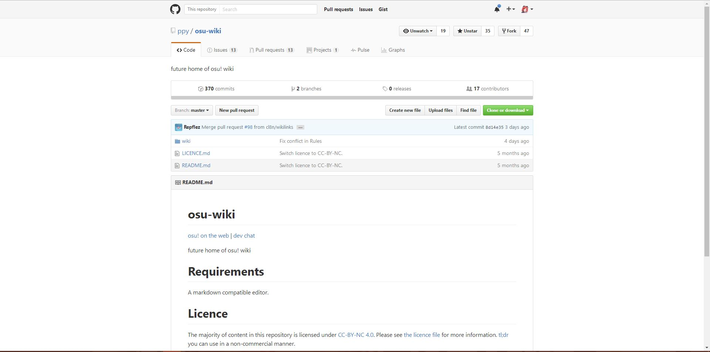

How to Contribute to the osu!wiki
==================

Thanks for your interest in making osu!wiki better! As you can see, everything has been moved to [GitHub](https://github.com/ppy/osu-wiki).

So here's a few things you should have in mind to get you started for contributing to the osu!wiki.

## Prerequisites

To be able to contribute to osu!wiki you must have the following:

- A [GitHub account](https://help.github.com/articles/signing-up-for-a-new-github-account/).
- Knowledge in [Markdown](https://github.com/adam-p/markdown-here/wiki/Markdown-Cheatsheet), specifically [Github-Flavoured Markdown(GFM)](https://help.github.com/articles/getting-started-with-writing-and-formatting-on-github/ "GitHub Help on Writing on GitHub").

Optionally, if you plan to make changes locally:

- A text editor with Markdown syntax highlighting.
  - We either use Microsoft's [Visual Studio Code](https://code.visualstudio.com) or Github's [Atom](https://atom.io).
  - Any text editor will suffice if you do not need the syntax highlighting.
- A Markdown previewer with **GFM** support. 
  - We use [Shiba](https://github.com/rhysd/Shiba), or Visual Studio Code/Atom's built-in GFM previewers.
- Basic knowledge in VCS (Version control system), particularly [Git](https://git-scm.com/ "Git").

## Forking
 
 To be able to make changes to the repository, you must first create your own copy of the repository. This is known as "forking".
 
 Go to the [osu!wiki repository](https://github.com/ppy/osu-wiki).
 
 You should see something like this.



Click on the "Fork" button, located at the top-right of the page. This should redirect you to the location for the fork.


Now click at your profile and GitHub would redirect you to where the fork is.

Finally, you should see something like this.


Congratulations! You have made a copy of the osu!wiki repository! You can now proceed to make changes.

## Making Changes 

### Through GitHub's Web Editor

If you don't want the hassle of cloning your fork into your PC, GitHub offers editing through your browser.

To edit a page, go to the folder of that page and select the language of that article. From here, you should see something like this.

_Note: Each article is grouped into folders where they contain markdown files arranged by language and their media. All article pages inside these folders must use the two letter language codes. To know which language code to use, see the [List of ISO 639-1 codes](https://en.wikipedia.org/wiki/List_of_ISO_639-1_codes) following the `639-1` column. Please follow this format when creating a new article._                  


Click on the pencil icon to edit; this should redirect you to the web editor.


If you want to preview your changes, click the "Preview Changes" tab. To go back and edit, click the "Edit File" tab.

After making your changes, scroll down and fill the following fields to explain your edit(s) to other contributors.


_**Note: Your commit message(s) must thoroughly explain your changes, otherwise, they may not get merged!**_

You would be given an option where to save your edits.

- **"Commit Directly to the ``xyz`` branch"** 
  - This will commit the changes through your branch directly.

- **"Create a New Branch"** 
  - Automatically creates a branch for your edits. A commit and a branch with a default name (normally, it would be called ``username : patch-1``) would be created.

A more detailed explanation about this can be found [here]( https://guides.github.com/introduction/flow/).

Pick an option and click "Commit Changes".

### Through your Local Machine

GitHub under the hood is a Git Service. You can clone your fork to your PC and make changes there.

If you have Git installed, enter this in your Command Line Interface (CLI):
```prolog
git clone https://github.com/<your github username (ie. peppy)>/osu-wiki 
```
*Note: If you don't have Git installed, you can go to [their website](https://git-scm.com/) to download Git and [set it up](https://help.github.com/articles/set-up-git/).*

and this should clone your fork into the folder you specified. You can now proceed to make your changes.

After making your changes locally, you will need to commit this on your local copy.

This can be done by entering this to the Command Line Interface (CLI): 
```prolog
git add .
git commit -m "<explain your changes here>"
```
However, some editors (ie. Visual Studio Code) may provide a Git interface.

After committing your changes, you need to push the commits to GitHub so everyone can see it. To do this, enter the following to your Command Line Interface:

```prolog
git push origin <branch>
```
This should prompt you to enter your GitHub login credentials. After you enter them, this should push your commits to GitHub.

_Note: Always check if your copy is synced with your remote. enter ``git status`` to check for any uncommitted changes and the status of your local repositry versus your remote repository._

_Note: However, If your authentication details were saved in Git already, no prompt will appear and will proceed directly to push. This can be done by [caching your Git credentials](https://help.github.com/articles/caching-your-github-password-in-git/)._

## Pull Requests

After pushing your commits, you must make a "Pull Request"(abbreviated as "PR"). This lets us know that your commits are ready to be reviewed.

Go to the "Pull Requests" tab.


This would lead you to the pull requests page.


This is the Pull Request Page. Now click on "New pull request"


We want to compare ``ppy:master`` against your branch.

From here, select the branch that contains your commits besides your "head fork".


_However, if you made changes in your master branch, the changes will be shown without the need to change anything in the head fork options._

Now after viewing your changes, click "Create Pull Request" and fill it with the following details:

- **Title** : The summary of the changes you have made,
  - Note: it is really important to have a meaningful and clear title, otherwise it will cause confusion.

- **Leave a Comment** : The details of the changes you have made.


Click on the "Create pull request" button and wait for a reviewer to check and, possibly, merge your changes to the official branch.

**Your commit messages should thoroughly explain your changes. Otherwise, the pull request may not be merged to the official branch!**

## FAQ

###  Why is the old osu!wiki not staying?

Due to abysmal performance, the old wiki is getting deprecated
as stated [here](https://github.com/ppy/osu-wiki/issues/69).

###  How would this differ from the old wiki?

- We use GitHub for collaboration. You can make mass changes easily and efficiently, and you can delay your changes for as long as you like.
- Unlike the old osu!wiki, changes has to be made via pull requests which are then reviewed by staff or someone with write permissions. This adds a layer of security against spammers and vandals.
- Linking is done manually, and must be done using static linking.
- **No Templates**. You must duplicate the template and paste it accordingly to the article you are editing.
- Addition, deletion, and renaming of media is easier and requires no special wiki function. However, this has to undergo the pull request protocol.
- Tables are supported by a bare-minimum with GFM (without extensions), unlike MediaWiki. However, this does mean we will need to code some tables with HTML for extreme cases.
- Markdown is sensitive. Using the wrong capitalization in links can break them (i.e. links and images).

### Can we use HTML?

We avoid the use of HTML with rare exceptions (usually for complicated tables).


## Conclusion
We hope this briefs you on how to contribute to the new osu!wiki. If you have any questions,
you can inquire at the [osu!dev Discord Server](https://discord.gg/ppy).
