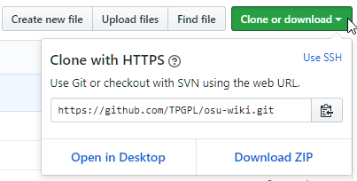
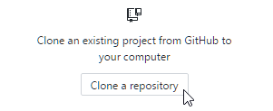
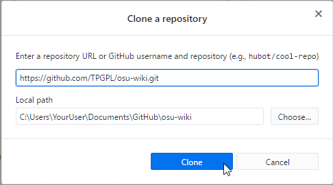
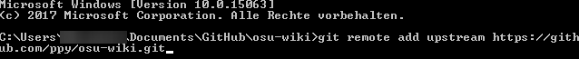
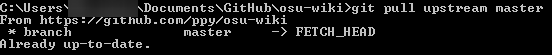
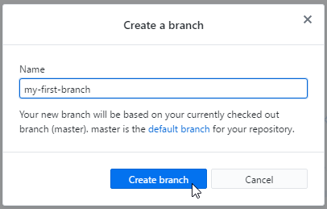
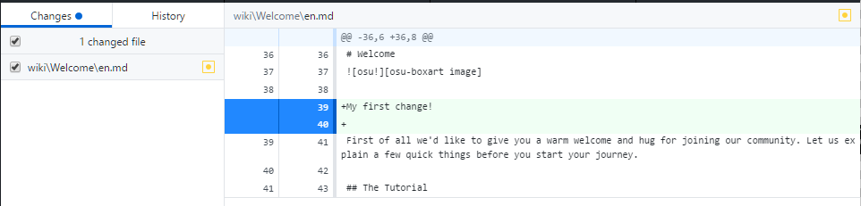
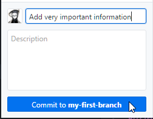
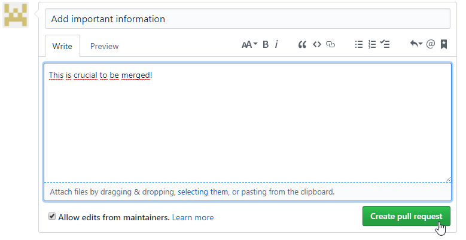

osu!wiki Contribution Guide
========================

This quick-start guide is intended for newcomers that have never worked with GitHub and the wiki contribution workflow before. If you already have experience using GitHub, feel free to skip this guide and follow the common feature-branch workflow for content updates in this repository.

## Preparations

1. [Sign up a GitHub account](https://github.com/join?source=header-home) if you don't have one already.
2. Fork the osu-wiki repository. This creates your very own copy of the osu!wiki files that you can edit freely without worries.
    - Go to the [osu-wiki repository page](https://github.com/ppy/osu-wiki) and click `Fork` in the upper-right corner of the page and wait until it is finished. You will then be led to the page of your forked repository.

      

3. [Download and install GitHub Desktop](https://desktop.github.com) or another tool to use Git. This guide leads you through the workflow with GitHub Desktop only though.
4. Run GitHub Desktop and sign in to GitHub.com after installation.
5. Clone your forked repository to your local PC. For that, go to the page of your forked repository and click the green `Clone or download` button. Copy the shown URL from it and use it

    

    

    

    

## How to use GitHub Desktop

Before working on the osu!wiki files, make sure that the files you work on are up-to-date. Working on outdated files will lead to *conflicts* and your work might be futile.

To keep your fork updated, do the following:

1. Go to the GitHub Desktop client while you have your forked repository opened
2. Make sure you have the `master` branch selected.
3. Click `Repository` on the menu header, then `Open command prompt`. A black command prompt window should open.
4. If you do this for the first time, enter `git remote add upstream https://github.com/ppy/osu-wiki.git` into the command prompt. This step can be skipped in future updates.

  

5. To update your forked repository, enter `git pull upstream master` into the command prompt.

  

In order to keep your work tidy, you should **never** work on the `master` branch of your forked repository, which is the clean copy of the osu!wiki. A branch is nothing more than a soft copy of your files, where you can make changes without affecting the squeaky clean `master` branch. Before starting to make changes, do the following:

1. Make sure that the current selected branch is `master`. Make sure that you updated your fork as described above. This assures that your new branch is based on the clean copy.
2. Click `Branch` and then `New Branch...` in the menu header. Give your branch a name. This is now your Work In Progress place based on the clean copy of the `master` branch.

  

3. Make sure that your freshly created branch is now selected.

  

4. You should create separate branches for each project or patch you are working on. For that, repeat the listed steps. Never work on multiple projects within the same branch. Keep it tidy! It will save you some headaches and makes it easier to *pull request* only specific changes of yours bit by bit.

Now you can **start working on the osu!wiki files**. For that, go to the folder you specified when cloning the forked repository. There you will find all articles and files that are used in the osu!wiki. Use any editor of your choice to make the changes you desire. Keep in mind that the osu!wiki uses [GitHub Flavored Markdown](https://guides.github.com/features/mastering-markdown/) for formatting purposes. Make sure to follow the [Article Style Guide](/wiki/Article_Style_Guide) when making changes.

In order to distribute your changes, do the following:

1. Save the files you made changes at.
2. Go to the GitHub Desktop client. You will notice that your changes are visible.

  

3. Fill the `Summary` text field with a short description of what you have changed. Make sure to commit regularly and in reasonable portions.
4. Commit your changes. You should use the branch you just created for your current project in order to save your changes to it and not to your clean `master` branch. These changes will then be exclusively available when having your project branch selected.

  

5. Once done will all the changes, *push* all changes to your forked repository by pressing the `Push origin` or `Publish New Branch` button (if you push for the first time with this branch).

  

## How to request your changes to be amended

In order to get your changes into the official osu!wiki itself, it is required to create *Pull Requests* from your forked repository into the original one. This is nothing more but a request to check your changes and take them over into the official version of the wiki. Your changes will then be reviewed and eventually amended or rejected.

1. Go to the page of your forked repository and click `New Pull Request`.

  

2. Select the right head fork and branch of your project you want to be amended. Select your forked repository at the `head fork` dropdown menu and your project's branch in the `compare` dropdown right next to it. Leave the two dropdowns on the left side alone.

  

2. Click the green `Create pull request` button in the yellow box.

  

3. Give your *Pull Request* a proper title and a description. Then click `Create pull request`. This will open the Pull Request and lead you to the page of it. Other contributors can now comment and review these changes.

  

4. You can find yours or other people's Pull Requests at the [osu-wiki repository](https://github.com/ppy/osu-wiki/pulls).

5. Make sure to open *Pull Requests* individually for each of your projects you want amended, so they can be reviewed one after another.

If you are asked to make changes to your work, you can commit them normally and your Pull Request will be automatically be updated.

We hope this briefs you on how to contribute to the new osu!wiki. If you have any questions, you can inquire at the [osu!dev Discord Server](https://discord.gg/ppy).
