<!-- Internal -->
[ASG]: /wiki/Article_Style_Guide "Article Style Guide"
[GitHub osu-wiki]: https://github.com/ppy/osu-wiki "osu-wiki in GitHub"
[GH Issue]: https://github.com/ppy/osu-wiki/issues "osu-wiki Issues page"

<!-- External -->
[osu!dev Discord]: https://discord.gg/ppy "osu!dev in Discord"
[MD]: https://github.com/adam-p/markdown-here/wiki/Markdown-Cheatsheet "adam-p's cheatsheet for Markdown"
[ISO 639-1]: https://en.wikipedia.org/wiki/List_of_ISO_639-1_codes "List of ISO 639-1 codes in Wikipedia"
[E325 error]: https://stackoverflow.com/questions/14513349/e325-attention-found-a-swap-file-by-the-name-git-commit-editmsg-swp "E325 question in Stack Overflow"
[Matt Liu image source]: http://www.slideshare.net/MatthewKLiu/git-branch-management "Git branch management by Matt Liu"
[Git set default editor]: https://swcarpentry.github.io/git-novice/02-setup/ "swcarpentry on setting up the default editor"
[Githowto resolve conflicts]: https://githowto.com/resolving_conflicts "Githowto's 30. Resolving Conflicts"
[git mergetool help by karenyyng]: https://gist.github.com/karenyyng/f19ff75c60f18b4b8149 "karenyyng's git mergetool guide"
[Ruslan Osipov's vimdiff tutorial]: http://www.rosipov.com/blog/use-vimdiff-as-git-mergetool/ "Ruslan Osipov's vimdiff tutorial"
[GH Blog GPG]: https://github.com/blog/2144-gpg-signature-verification "GitHub blog on GPG signature verification"
[GPG guide by Duncan]: http://mrexodia.cf/guide/2016/05/30/Github-Gpg "mrexodia blog post on GitHub GPG by Duncan"

<!-- GH Help -->
[GitHub Help]: https://help.github.com/ "GitHub Help"
[GH account]: https://help.github.com/articles/signing-up-for-a-new-github-account/ "GitHub Help in Signing up an account"
[GFM]: https://help.github.com/articles/getting-started-with-writing-and-formatting-on-github/ "GitHub Help on Writing on GitHub"
[GH Help feature branch]: https://help.github.com/articles/what-is-a-good-git-workflow/ "GitHub Help on Git workflow"
[GH Guide feature branch]: https://guides.github.com/introduction/flow/ "Interactive visual Git workflow"
[GH Help Git setup]: https://help.github.com/articles/set-up-git/ "GitHub Help in Setting up Git"
[GH Help fork]: https://help.github.com/articles/fork-a-repo/ "GitHub Help on fork a repo"
[GH Help cache git password]: https://help.github.com/articles/caching-your-github-password-in-git/ "GitHub help on Caching GitHub Password in Git"
[GH Help webbranch view]: https://help.github.com/articles/viewing-branches-in-your-repository/ "GitHub Help in viewing branches in your repository"
[GH Help webmerge conflicts]: https://help.github.com/articles/about-merge-conflicts/ "GitHub Help about merge conflicts"
[GH Help solve webmerge conflicts]: https://help.github.com/articles/resolving-a-merge-conflict-on-github/ "GitHub Help on resolving merge conflicts"
[GH Help solve git merge conflicts]: https://help.github.com/articles/resolving-a-merge-conflict-using-the-command-line/ "GitHub Help on resolving a merge conflict using the command line"
[GH Help GPG]: https://help.github.com/articles/signing-commits-with-gpg/ "GitHub Help on signing commits with GPG"

<!-- Programs and Extensions -->
[VSC]: https://code.visualstudio.com "Visual Studio Code"
[Brackets]: http://brackets.io/ "Brackets"
[Atom]: https://atom.io "Atom"
[Shiba]: https://github.com/rhysd/Shiba "Shiba"
[Git]: https://git-scm.com/ "Git"
[Git Extensions]: https://gitextensions.github.io/ "Git Extensions"

# 如何在 osu!wiki 中作出自己的贡献
感谢您对 osu!wiki 的支持。

也许您已经发现，所有内容都已经移动到[Github][GitHub osu-wiki]。
 
如果您想要编辑 osu!wiki，请时刻牢记以下几点。
 
## 声明
这份快速指南是提供给不熟悉分支工作的 Github 新人的。如果您之前有过使用 Github 的经验，您可以跳过这份指南。


这里有一份中文的[Github教程](https://git-scm.com/book/zh/v2/GitHub-%E8%B4%A6%E6%88%B7%E7%9A%84%E5%88%9B%E5%BB%BA%E5%92%8C%E9%85%8D%E7%BD%AE)

完整的参考与帮助请点击[GitHub帮助][GitHub Help].

关于文章风格请参考[Article Style Guide(文章风格指导)][ASG]

如果有任何疑问，请前往[osu!dev Discord 频道][osu!dev Discord], 在 `#osu-wiki` 子频道提问。

阅读全文大约需要1小时。

## 准备

想要在osu!wiki中作出自己的贡献，您需要：

- 一个 [GitHub 账号][GH account]。
- 懂得 [Markdown][MD] 与 [GitHub-Flavoured Markdown(GFM)][GFM]。
- [理解 Git 的工作模式 (分支工作)][GH Help feature branch]。
  - [关于分支的解释][GH Guide feature branch]。
- 具备基础英语语言能力。为了格式一致，最好使用英式英语。
  - 所有与文章内容不相关的文字,包括注释消息(commit messages)，PR，文件名等**必须**使用英语。

如果您想要离线编辑，您需要：

- 一个文本编辑器。
  - 最好可以高亮显示 Markdown 语法。
    - 我们通常使用微软的 [Visual Studio Code][VSC]，Adobe 的 [Brackets][Brackets]，GitHub 的 [Atom][Atom].
- 一个**支持__GFM__**的Markdown预览器。
  - 我们通常使用 [Shiba][Shiba] 或者 Visual Studio Code / Atom 内置的 GFM 预览器。
- 关于版本控制系统(Version Control System)的基本知识，特别是[Git][Git]的有关知识。
  - 如果您在使用 Git 的命令行版本中遇到了困难 （这份指南的后文会有解释），您可以使用有图形操作界面版本的 Git 或者使用如 [Git Extensions][Git Extensions]的程序。
  - 一些提供 Git 交互界面的编辑器 (例如 Visual Studio Code)。

## 克隆 osu-wiki 内容库

如果您想编辑 osu-wiki 的内容，您必须先创建所有内容的拷贝。这个步骤被称为 Fork（派生）。

前往 [osu-wiki repository][GitHub osu-wiki].

您应该会看到这样的页面：

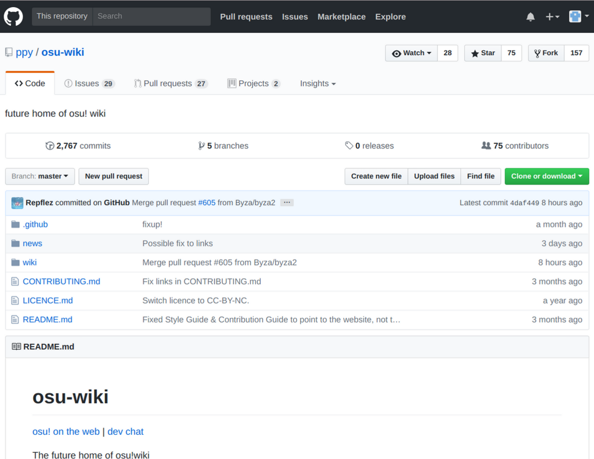

点击右上角的 Fork 按钮


接下来选择您的头像（这一步可能不出现），将前往您fork的仓库。
 
稍微等待一会，您会看到这样的界面：

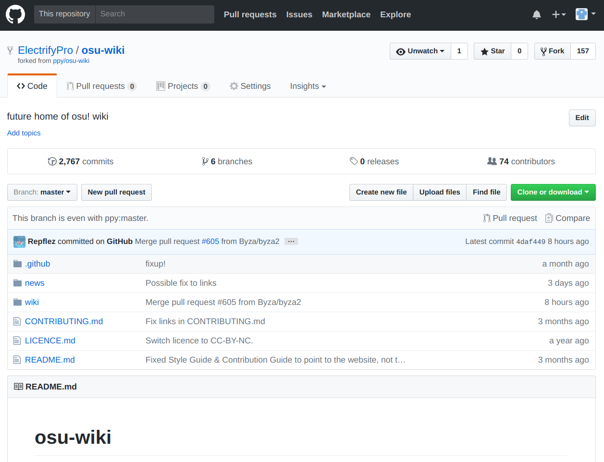
 
祝贺您！您已经成功克隆了 osu-wiki 的内容！现在您可以进一步进行编辑了。

## 编辑 

### 分支工作的概念

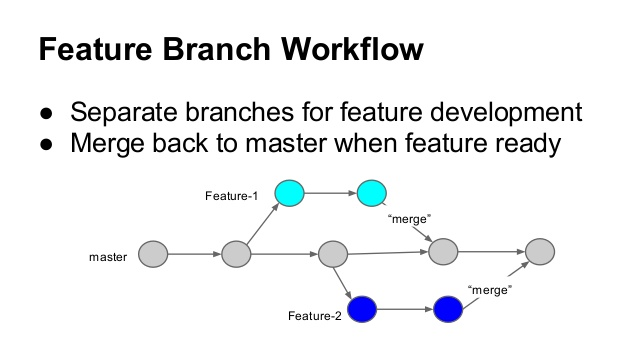

_[Image taken from Slide 6 from Git branch management by Matt Liu][Matt Liu image source]_  

 
事实上, 您可以在 `master` 分支内完成一切编辑，但是_从长远来看_这并不是一个好习惯。
 
这就是为什么需要进行分支工作的原因。
 
通过建立工作分支，您可以在保留原有`master`分支完整的前提下在自己的分支中进行修改与编辑。

碰到严重错误时，不妨删除这个分支，在`master`分支下重新创建一个新的分支。

### 使用 Github 的网页编辑器

#### 进入正确的仓库和分支

如果您不想把您的fork仓库全部导入电脑，Github 提供了一个在线编辑器。您可以在浏览器中直接进行编辑。

首先进入您的仓库。（小技巧：在浏览器的地址栏中，把``https://github.com/ppy/osu-wiki`` 中的``ppy``改成自己的 Github 账号名称，回车就可以快速进入自己的仓库了） 

系统默认每次进入都是`master`分支（主分支）。

#### 创建新分支

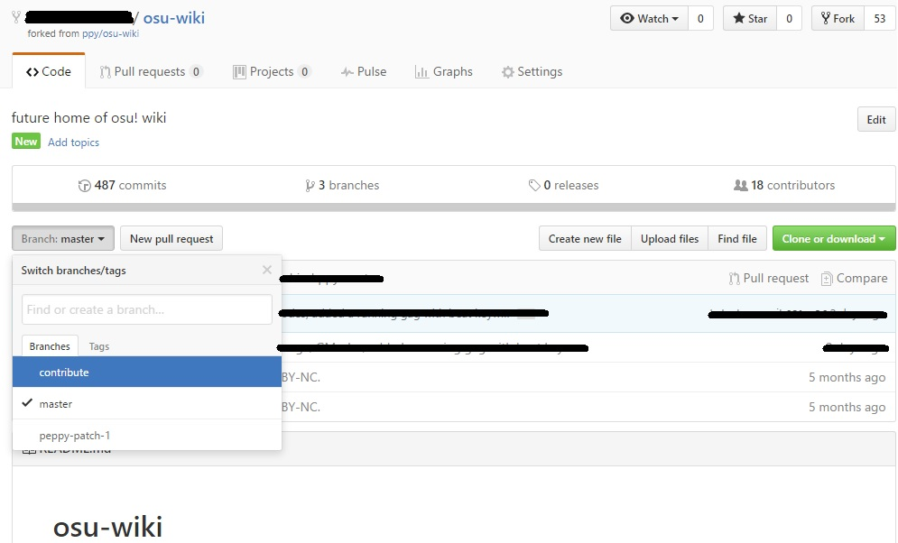
 
点击 `Branch: master` 按钮后，可能会显示几个分支，但其中最重要的就是`master` 分支。
 
在文本输入框中输入分支名称。按下 Enter（回车）后就会前往该分支。如果没有这个分支，则会新建一个基于`master`的分支。

_注意：在新建分支时请确保您在 `Branch: master` 分支下，因为新建的分支总会继承您创建分支时所在的分支。_

现在 ，重新查看下拉菜单，会出现 `Branch: <您的分支名称>`。 您现在已经做好了准备，可以开始编辑文章了。

#### 更新分支内容

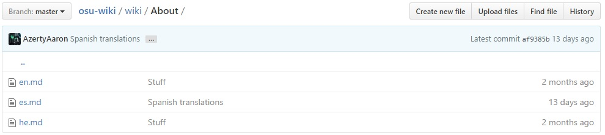 
_注意: 每篇文章都被放在子文件夹下，按照语言代码顺序排列。_

所有文章都是后缀名为`.md`（markdown）的文件。

所有文章的文件名都应该是两个代表文章语言的字母。

某种语言对应的代码可以在[ISO 639-1 代码表][ISO 639-1]中找到。

在新建文章时请遵守这些规则。中文文章的完整文件名应为`zh.md`。参见[文章风格指导][ASG]

要编辑一篇文章，前往它所在的文件夹并选择对应的语言.

之后，您将看到这样的页面:            

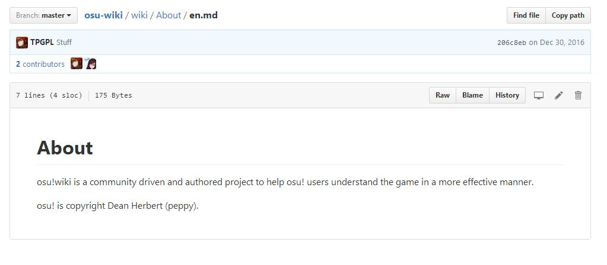

##### 添加文件

如果您的语言不在文件夹中,点击 "Create new file" 按钮.

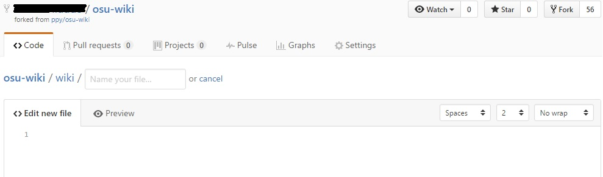

文件命名规则前文已有提及。

在做出改动后，向下滚动到 _Commit Changes_ 并填写相关内容来解释您的改动。

##### 添加文件夹

**在添加文件夹前，请在 [Issues][GH Issue] 提出您的改动以避免做无用功。
这是因为您操作文件夹必须通过 Git 进行。**

请先想好文件夹的名字并且文件夹内必须有一个非空文件。

组织好您的目录结构。
然后点击 Upload files 。

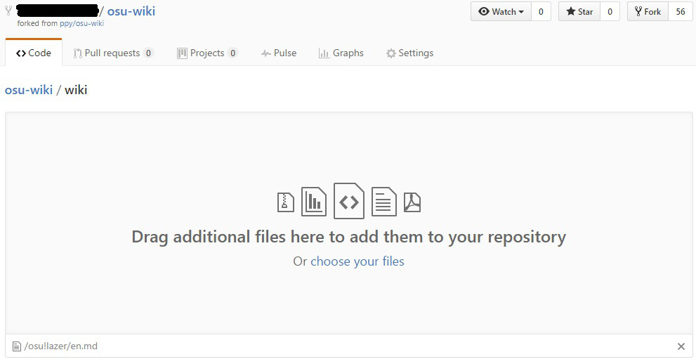

拖动文件夹到上传文件区域。

在确认改动后同样填写好相关信息。

##### 更新文件

如果某篇文章写得很糟糕或是存在错误，点击铅笔图标来编辑它。

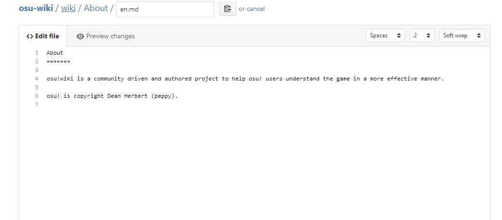

如果您想预览您的改动，点击 "Preview Changes" 。
点击 "Edit File" 以回到编辑界面

在确认改动后同样填写好相关信息。

#### 提交改动


_**注意：您的提交信息必须能解释您的改动，否则您的改动可能会被拒绝！
记住，提交信息应该使用英语.**_

您可以选择在哪个分支保存您的改动.

- **"Commit Directly to the `xyz` branch"**
  - 这会将改动提交到您当前所在的分支.

- **"Create a New Branch"**
  - 为您的此次改动创建一个新分支.
    默认时，分支名称为 `用户名 : patch-#` ， `#` 是一个数字，从 `1` 开始。

选择一个选项然后点击 "Commit Changes" 。

### 在本机上进行

GitHub是一个Git服务器，
你可以克隆仓库到您的机器上继续进行您的更改。

接下来的部分将指导您使用命令行版本的Git.

如果您不习惯命令行,您可以自学带图形界面的Git，例如 [Git Extensions][Git Extensions].
一些编辑器（例如VS Code）也提供了Git接口.

请记住，远端复制与本地复制不一样.
如果您commit而没有推送到远端, you are effectively talking to yourself.

您可以不急着推送到远端, 但是当您完成的时候最好马上推送.
不过我们更喜欢commit后马上推送.

#### 一次设置

##### 本地仓库设置

_注意: 如果您没有安装Git, 你可以前往 [Git 官方网站][Git] 下载 Git 并 [设置][GH Help Git setup] (跳过步骤1)._

Once you have Git installed and ready to deploy (see the note above if you have not), open up Git Bash or your terminal directly and enter this in the Command Line Interface (CLI):

```prolog
git clone https://github.com/<your GitHub username>/osu-wiki.git
```

Replace ``<your GitHub username>`` with, well, your GitHub username you sign up with and fork from.

This will clone your fork (``master`` branch only) in the filepath you specified (usually in your user's home folder, when running Git directly by default).
Moreover, the link is now nicknamed to ``origin``, and the significance will be explained at the next header.

Make sure you are connected to the Internet before using the command.
Also, please consider doing this in an unmetered connection like a Wi-Fi area to preserve your connection quota, as the content size of osu-wiki is _quite large_.

_Note: For further reference, check [GitHub Help on fork a repo][GH Help fork]_

##### Nicknames significance

Head to the cloned fork folder first. Type this to the CLI:

```prolog
cd osu-wiki
```

The terminal command, `cd`, will move Git down to ``osu-wiki``, which is where your freshly created local copy is at.

Remember the previous mention about ``origin``?

Well, do the below first:

```prolog
git remote add upstream https://github.com/ppy/osu-wiki.git
```

The command will set the link (which is the osu-wiki official repository link) to the nickname of ``upstream``.
If you do not like the ``upstream`` nickname, you can change it to whatever you like, but the guide onwards will still use ``upstream`` nickname to refer to the ``osu-wiki`` official repository link.

Now you have two nicknames, ``origin`` and ``upstream``.

Nicknames are just link-shorthand for you to type in Git when you want to do something, such as telling Git to push (important) local changes to where it should be or telling Git to cross-check and update your own local copy with the latest official copy.
You can have more nicknames with links based on other repositories of ``osu-wiki``, but two is mostly sufficient for now.

Use the command below if you want to know what nickname is referring to what link:

```prolog
git remote -v
```

It will show you all the nicknames and the links it reference to.
It should show something as below:

```prolog
origin  https://github.com/<your GitHub username>/osu-wiki.git (fetch)
origin  https://github.com/<your GitHub username>/osu-wiki.git (push)
upstream        https://github.com/ppy/osu-wiki.git (fetch)
upstream        https://github.com/ppy/osu-wiki.git (push)
```

##### Default terminal text-editor

Reference: <http://web.mit.edu/6.005/www/sp14/tutorial/git/config.html>

To do a quick test, type in ``nano``/``vim``/``emacs`` in Git Bash or terminal, and see what happens.
If the terminal changed rather than an error given, then Git is most likely using this terminal text-editor by default.
Read what was given for the quit command.

- By default, you will be using ``nano`` if you are in Linux environment.
- If you are in Windows environment or your Linux environment does not provide ``nano`` by default, then ``vim`` will be used instead.
- For Mac OSX environment, ``emacs`` should be set by default if it is not ``nano``, or ``vim`` will be used instead.

If you have an adversity to terminal text editor, and want to use a familiar text editor like Notepad++ or GitHub's Atom instead, [swcarpentry provides a guide to set Git to always use that instead][Git set default editor].

If you are fine with the given terminal text editor, then you can skip the above configuration and read below.
If you already set your own, ignore below and head to the next header.

---

For ``nano``, it is very self-explanatory as all the important commands was shown at the lower part of the editor.

Press these two keys, ``Ctrl``-``X``, together at the same time to exit ``nano`` editor.
If the content was changed, the lower-part will be changed to ask for confirmation; press ``Y`` key to save changes, or press ``N`` key to cancel changes.

---

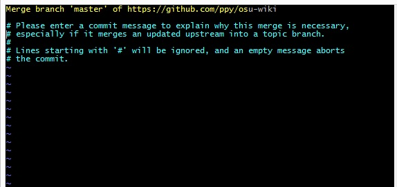

For ``vim``, it has its own set of keyboard commands, and most of it can be ignored unless you are using it to write files.

The only three keywords you need to remember when using ``vim`` appears are as follow:

```
1. i   (lowercase i key, once)
2. Esc
3. ZZ  (UPPERCASE Z key, twice) or :q (a colon and a lowercase q key)
```

By default, you will be in normal mode.

- The first command tells ``vim`` to go to insert mode, so you can write on it.
  - If you do not want to modify the text content, you can directly skip to the third command if the first command was not used.
- The second command tells ``vim`` to go back to normal mode, which allows you to exit.
- The third command tells ``vim`` to save and exit if some text was given; exit and abort the commit if no text was given.

Oh, and if you got the [E325 error][E325 error], do this:

```prolog
rm .git/.COMMIT_EDITMSG.swp
```

#### Accessing your local copy

Open up Git Bash or your terminal of choice (if you have not), and type in this command in the CLI:

```prolog
git status
```

This command is used to check for Git's response about the status of the local copy in this directory.

If it throws up an error (meaning, you are in the wrong directory), type in this command in the CLI:

```prolog
cd ~
cd osu-wiki
```

Assuming you are following the guide and did not do any modification to Git Bash/terminal (saving the cloned osu-wiki repository in your user home's folder):

- The first command tells the terminal to go back to your home directory, `~` (if you somehow end up somewhere).
  - An alternative method is to reopen the Git Bash/terminal again.
- The second command, using the terminal command, `cd`, will move the terminal down to ``osu-wiki`` if found, which is where your freshly created local copy is at.

or

```prolog
cd ~/osu-wiki
```

Which does the same thing as above.

There should be a light-blue coloured brackets with text inside (``master``) at the end of the line when done right in Git Bash.
That is the branch name your local copy is currently in.

You can now proceed to make your changes.

#### Making a new branch

To check for available branches, enter the command below in the CLI:

```prolog
git branch
```

This command will show all the branches of the remote repository (namely, your forked repo, nicknamed ``origin`` by default) copied into your local copy.
If you are starting fresh, you will be in ``(master)`` branch by default.

To switch to a branch, enter the command below in the CLI:

```prolog
git checkout <branchname>
```

Once completed, your local copy will be updated exactly to the branch copy version you switched to.
You are now in the branch specified in ``<branchname>``.
If you forgot to save the files before switching, try and see if your text editor still keeps it or not.

To make a new branch, enter the commands below in the CLI:

```prolog
git checkout master
git checkout -b <branchname>
git push origin <branchname>
```

- The first command returns the Git back to ``master`` branch.
  If you are already in ``master`` branch, nothing happens.
- The second command makes the ``<branchname>`` branch copy based on ``master`` branch.
- The third command updates your forked remote copy (``origin``, remember?) with a new ``<branchname>`` (make sure you are connected to the Internet before pushing anything).

You are now in the new branch you created and its time to make some local changes.
Go ahead and mess with the ``osu-wiki`` directory content.

#### Updating the branch content

After making your changes locally (such as add/delete/rename/move/modify files/folders), you will need to commit (update) this on your local copy.

This can be done by entering this to the Git's CLI:

```prolog
cd ~/osu-wiki
git add .
git commit -m "<short title>" -m "<long description>"
```

- The first command will direct Git to the root of the repository (assuming the repository was cloned at user's home directory)
- The second command will **stage everything**, including untracked and changed files.
  - You can also substitute ``.`` with the filepath you want to stage manually, one-by-one.
- The third command takes a GitHub's snapshot (``commit`` keyword) with a refined commit message of a title (the first ``-m "<short title>"``) and a description (the second ``-m "<long description>"``).
  - Please try to avoid the use of punctuation, to prevent errors or unexpected behaviour.
  - Also, write the commit message in **English**.
  - If you write longer than the 72 characters limit for the title, the rest of the text will be shown in GitHub's hidden commit description instead.

_Note: Omitting the ``-m`` attribute will send you to a CLI text-editor interface by default or your predefined text-editor instead to write your summary.
If you are not well-versed with CLI text-editor, or do not want to open your predefined text-editor to write, use the ``-m`` attribute._

After committing your changes, you need to push the commits to GitHub so everyone can see it.

To do this, enter the following to your CLI:

```prolog
git push origin <branchname>
```

This should prompt you to enter your GitHub login credentials.
After you enter them, this should push your commits to GitHub.

**Note:**

- Always check if your local branch copy is synced with your remote branch.
  - Enter ``git status`` to check for any uncommitted changes and the status of your local repository versus your remote repository.
- If your authentication details were saved in Git already, no prompt will appear and will proceed directly to push.
  This can be done by [caching your Git credentials][GH Help cache git password].

## Pull Requests

### Finding the pull request button

After pushing your commits, you must make a "Pull Request"(abbreviated as "PR").
This lets us know that your commits are ready to be reviewed.

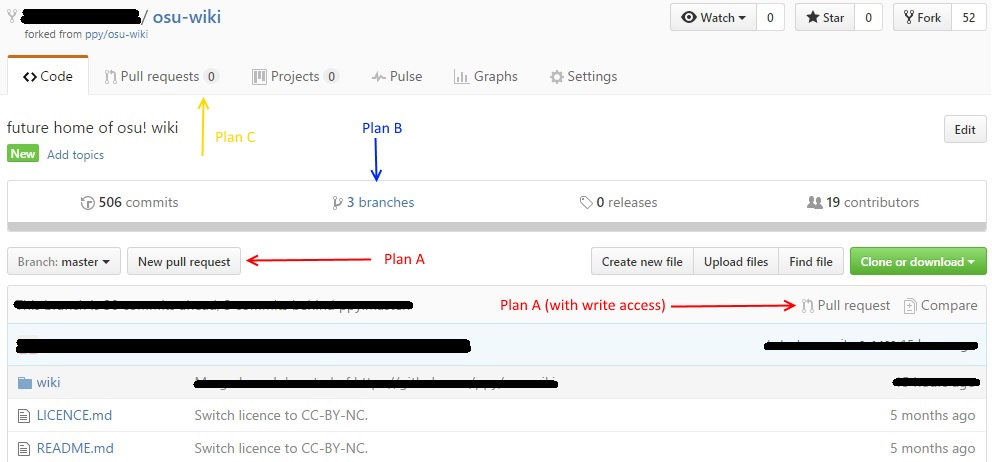

There are three ways (four, if you have write access to the repository) of making a pull request.
Each of the ways are separated by a plan header, and all of them will lead to the creation of a PR.
Pick your favourite plan and stick to it.

To begin, go to your own forked repository.

#### Plan A (PR current branch)

Switch your ``Branch: master`` dropdown button **to the branch you want to do a PR** for.

Then, press on either the "New pull request" right beside the dropdown button, the "Pull request" with a merge-branch icon right beside the "Compare" button, or the "Compare" button.

Either one of the buttons will still lead you to the same PR branch compare page.

#### Plan B (The branch page)

Click on the "Branches" icon and text to go to the branches page.


You should roughly get the screen as shown above.
You can overview your branch status and do clean-up like deleting the branches by pressing the red trashcan icon.

Since you are here for PR, click on the "New pull request" on the branch you want to do PR on.

#### Plan C (The PR page)

Go to the "Pull Requests" tab, or the "New Pull request" button beside the branch.

This would lead you to the pull requests page.

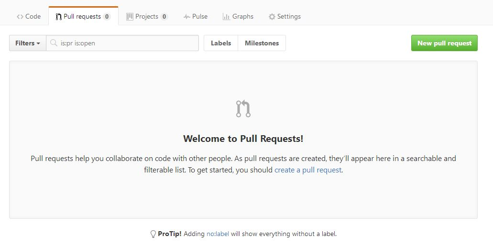

This is the Pull Request Page.

Now click on "New pull request"

### Preparing the PR


We want to compare ``ppy:master`` as base fork branch against your branch as head fork branch.

From here, select the branch that contains your commits besides your "head fork".


Now after viewing your changes, click "Create Pull Request" and fill it with the following details:

- **Title** : The summary of the changes you have made
  - It is really important to have a meaningful and clear title, otherwise it will cause confusion
  - Please write it in **English**

- **Leave a Comment** : The details of the changes you have made
  - Also, write it in **English**

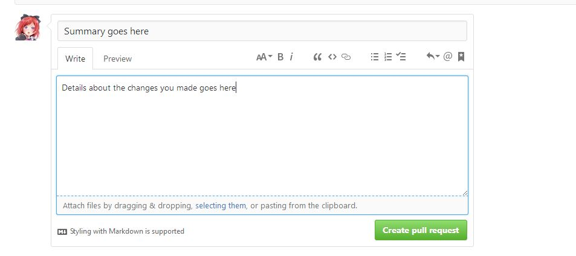

Click on the "Create pull request" button.

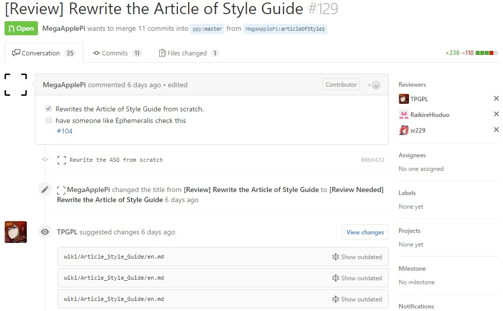

With the PR up, you can either refine your PR content and files by pushing to the branch or wait for a reviewer to check for errors.
If your PR was deemed good enough, a _Team osu!_ member may come and merge your changes to the official branch.

**Your commit messages should thoroughly explain your changes.
Otherwise, the pull request may not be accepted to the official branch!**

## Repo Sync and cleanups

Two important things you must do at all cost:

1. Updating your ``master`` branch to the latest official ``master`` commit.
2. If the branch has merge conflicts, fix it immediately.

Updating a branch and cleaning up stale/merged branches is an optional personal task.

### Through GitHub's Web Editor

#### Branches cleanups

Go to your own forked repository.

There are two ways of cleaning a branch:

- overview branch cleanup, and
- merged/closed PR manual branch deletion.

As the second way requires the branch to be merged/closed for the branch's delete button appear in the merged/closed PR page, the first way of cleaning the branches is preferred for this guide.

Click on the "Branches" icon and text to go to the branches page.


You should roughly get the screen as shown above.
Click on the red trashcan icon on the branch you want to delete.
The branch will be marked for deletion, and will be deleted after you leave the page.

Once you have done cleaning the branches, it is time to update your own forked repository.

_Note: For further reference, see [GitHub Help in viewing branches in your repository][GH Help webbranch view]_

#### Branch sync

Go to ``ppy/osu-wiki`` repository this time.

_Note: While technically you can go back to your own repository to do the PR, the amount of clicks needed coupled by zealous page refresh the moment you change the fork or branch may soon become a test of your patience, and your connection quota._

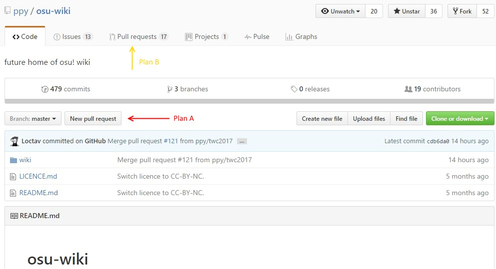

Pick either one of the plan to access the PR compare page.

If you go for plan B, click on the green "New pull request" button.

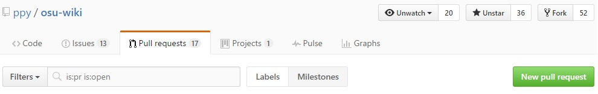

Now, you should see the page as shown below:


Click on the blue keyword, _compare across forks_.
The fork dropdown buttons will be added.
Set the base fork as your own forked repository (the second one in the dropdown list, usually).
A page refresh will occur when the fork was changed.

If there are changes to PR, you should see the page now as below:

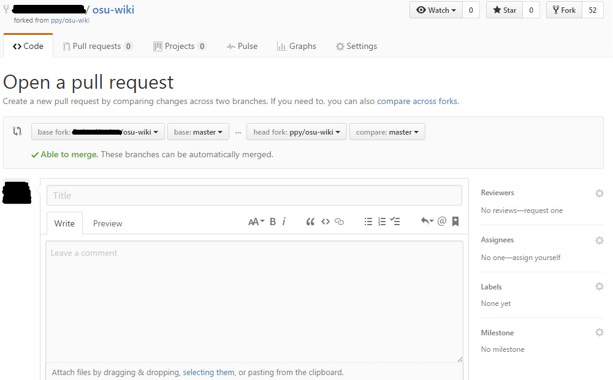

Pick the branch you want to pull from and a page refresh will occur.

Fill up the PR information (you can just write anything since it is your own repo), and press the green "Create pull request".

You will be directed to your freshly-created PR page:

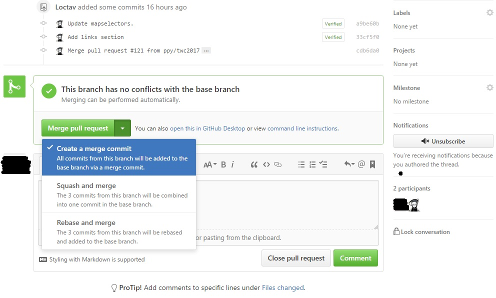

Scroll down to the lower part of the page.
Always set your green "Merge pull request" button to "Create a merge commit", which is set by default.

Press the green "Merge pull request" button.

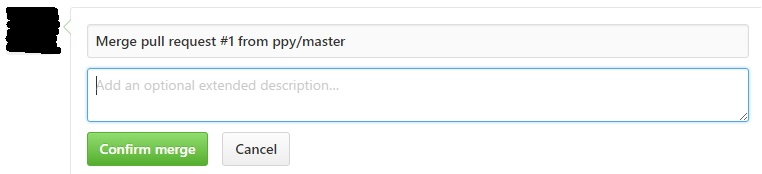

Click on the green "Confirm merge" button and the branch will be updated successfully to the latest version.

To update your other branches, do the same thing in this section in a new PR but with different branch this time.

#### Merge conflicts

[Read this GitHub Help for an overview about merge conflicts][GH Help webmerge conflicts]

[Read this GitHub Help on resolving merge conflicts in GitHub itself][GH Help solve webmerge conflicts]

### Through your Local Machine

#### Branches cleanups

_Note: It is highly suggested to do branch cleanups locally.
It is best not do any web branch cleaning in GitHub if you have a local copy._

```prolog
git checkout master
git branch -d <branchname>
git push origin :<branchname>
```

- The first command set the branch to master.
  This will allow you to delete the other branches.
- The second command will tell Git to delete the branch.
  If Git refuse to delete it for a reason (usually the branch was not updated) but you do not want the branch anyway, use the force delete variant by replacing the soft local delete attribute, ``-d``, to force local delete attribute, ``-D``.
- The third command will update the forked remote repo to also remove the branch (make sure you are connected to the Internet).
  The colon, ``:``, will tells Git to delete this ``<branchname>`` branch in the ``origin`` nickname (which is your forked remote repo).

#### Branch sync

Do a checkout to the branch you want to sync.

```prolog
git checkout <branchname>
```

There are two ways of updating it:

- The first way provides a open choice (will not be explained in this guide) to do a forensic check on what was changed before doing any merging.
- The second way is best used if you know that there will not be any merge conflicts, does not care about what was changed, and lazy to type two commands.

Both commands will provide the same outcome, and will complain about the merge conflict(s) if found.

##### Fetch + Merge

```prolog
git fetch https://github.com/ppy/osu-wiki.git
git merge https://github.com/ppy/osu-wiki.git/master
git push origin <branchname>
```

or, if you nicknamed ``https://github.com/ppy/osu-wiki.git`` to ``upstream`` for example, then the below will work too:

```prolog
git fetch upstream
git merge upstream/master
git push origin <branchname>
```

- The first command collects all the changes from all the official repository branches (must have connection to the Internet).
  - If you want to know all the branches, including the fetched remote branches: ``git branch -a``.
    - The fetched remote branches will all be coloured in red in Git Bash if the command was used.
  - All fetched changes will be stored as ``https://github.com/ppy/osu-wiki.git/<branchname>``, or if nicknamed, ``upstream/<branchname>``.
  - You only need to fetch once before attempting to update all the local branches.
    - For other branches, continue directly to the second command after you fetched and merged the first branch.
- The second command attempts to merge the official master branch changes to your current branch.
  - If a merge conflict arise, refer to _Merge conflict_ below on how to resolve it.
    In this case, the merge commit will fail, and you must do the regular commit after solving the conflict.
  - If the local merge commit was successful, Git will ask for a commit message with a default given for this merge commit using the terminal text-editor/your text-editor.
    Just exit it (the default message is more than enough to explain the commit itself).
- The last command is to update your own remote repo's branch with the updated local copy of this branch.
  As usual, make sure you are connected to the Internet before doing any pushing.

##### Pull

```prolog
git pull https://github.com/ppy/osu-wiki.git master
git push origin <branchname>
```

or, if you nicknamed ``https://github.com/ppy/osu-wiki.git`` to ``upstream`` for example, then the below will work too:

```prolog
git pull upstream master
git push origin <branchname>
```

- The first command is, frankly, a fetch and a merge in one command.
  - Read the description of the _Fetch + Merge_ above for the first command and the second command.
    It is exactly the same.
- The last command is to update your own remote repo's branch with the updated local copy of this branch.

#### Merge conflict

If you received merge conflict(s) when doing a merge/pull, the merge/pull will fail.
In this case, you should fix the conflicting changes, and do a regular commit instead.

When a merge conflict occurs, your Git Bash/terminal will be locked to the branch until you complete the merge conflicts.
An extra ``| MERGING`` notice will be added to the brackets to signify the importance of fixing the merge conflicts at all cost.

To remove it, there are two safe ways of doing it:

- The manual method, being much more straightforward but becomes very tedious quickly the more files with conflicts.
- The mergetool method, requiring some familiarity with the default tools used without explicit configuration and installation of other program by personal preference.

To check for files with merge conflict, use:

```prolog
git status
```

A typical textfile merge conflict will look like this:

```
<<<<<<< HEAD
    <myLocalContent>
=======
    <osu-wikiContent>
>>>>>>> master
```

Read the content difference, and decide whether to rewrite it, or keep either one.
You should delete the ``<<<<<<< HEAD``, ``=======``, and ``>>>>>>> master`` once you have decided on the content to keep.

Continue to search for next merge conflicts, and save when there is no more merge conflict in this file.

For major or complicated merge conflicts, ask for help.

##### Manually

Reference: [Githowto on resolving conflicts][Githowto resolve conflicts] and [GitHub Help on resolving a merge conflict using the command line][GH Help solve git merge conflicts]

The procedure is basically:

1. Use ``git status`` to collect the files with merge conflict(s).
2. Open the file using your text-editor of choice.
3. Find for ``<<<<<<<``.
4. Read the content difference, do a revision there, and remove all the merge conflicts symbols (``<<<<<<< HEAD``, ``=======``, and ``>>>>>>> master``) of this section.
5. Return to Step 3, until no more merge conflicts in this file.
6. Save the file.
7. Continue with other files starting with Step 2.
8. Pick the image you want to keep by deleting the old ones.

Once the ``git status`` gives all-green answer in your Git Bash/terminal, commit and push the changes.

##### Mergetool

[Read this guide by GitHub user karenyyng on using git mergetool to resolve merge conflicts][git mergetool help by karenyyng]

For practice in using the mergetool, try [Ruslan Osipov's tutorial in using vimdiff][Ruslan Osipov's vimdiff tutorial], with a nice simulation guide to do a test merge conflict (just delete the folder once you are done with it, there is no need to push).

#### Pushing solved merge conflicts

Once all the merge conflict(s) resolved, do a commit with a message, and push to your remote branch.
Like so:

```prolog
cd ~/osu-wiki
git add .
git commit -m "Solved merge conflicts"
git push origin <branchname>
```

The extra ``| MERGING`` notice will be removed from the brackets once the commit was completed.

## FAQ

### But Markdown supports HTML tags, can I use them?

**No.**
This also includes any CSS styling, inline styling and colours.

The current osu!wiki supports **GFM syntax only**.

GFM is based on Markdown; which is basically a simplified subset of important HTML tags for styles that contains:

- **bold**
- _italics_
- ~~strikethrough~~
- `code` (inline and block)
- order lists
- bulleted lists
- images

With GFM, we can also use:

- simple tables

While Markdown and GFM _does_ support a few HTML tags in GitHub, osu!wiki articles will not be using them.

For further information on a styling guide when writing a page, check out [Article Style Guide][ASG].

### Why does the file I uploaded not load on the osu!wiki?

Currently, **1MB** size is the upper limit for any files.
Resize or compress the file to stay below the file limit.

Also, check the file extension in use.
Use only lowercased variant of the file extension (like ``.jpg``, ``.gif``, ``.png``, or ``.md``).

### What are the green "Verified" button beside the commits in a PR page?

[GitHub supports GPG signature verification as written in their blog post][GH Blog GPG].

It is a personal proof that the commit made by the account user personally, not from a malicious account using the same name.
By default, all accounts will not have the "Verified" button, as it is an optional commit integrity feature.

To get the "Verified" button, it will take a while; from downloading a tool, generation of the key from the tool, and some careful configuration.

- For a Windows-only guide, check [the mrexodia's blog post guide by Duncan][GPG guide by Duncan]
- For a GitHub's guide, check the [GitHub index page for GPG][GH Help GPG]

Do note that it is only applied to **Git usage only**, and is not related to two-factor authorisation.

### Help!

Use the search engine of your choice and type in your help request.
If you cannot find the answer, you are not trying hard enough or your question is too ambiguous.
Use only the keywords or refine your search and try again.
Usually, copy-and-paste the issue code directly might get you an answer, but effectiveness varies.

For further help, you can ask someone in the [osu!dev Discord chat][osu!dev Discord] (``#osu-wiki`` channel).
Make a Discord account if you have not and go to the `#arrival` channel first if this is your first time to state your reason of being here.
Depending on severity of the problem and members' active time, you may or may not get the answer.

You _could_ also make an issue in [osu-wiki's Issues tab][GH Issue] to get help; however, the response time will vary and likely to be ignored if it is off-topic or trivia issue.

Alternatively, if you are on Git, prefers to discover a way of solving yourself, have no connection right now, and do not mind reading the manual with its own terminology, use

```prolog
git
```

or

```prolog
git help
```

It will show you a list of most of the commonly-used Git commands.

If you need further reference on the command, for example, ``git pull``, use

```prolog
git help pull
```

This will open your default browser with the manual of the command written as a HTML page.

Also, terminal commands will work as usual; Git is just one of the installed additional feature in terminal environment which can be called by `git` keyword.

### What happened to the old osu!wiki?

The osu!wiki is in a process of being moved over to GitHub.
This is because MediaWiki (the engine that the old osu!wiki ran on) has many performance issues.
The old osu!wiki also had no solution to prevent spam.

### How would this differ from the old wiki (running on MediaWiki)?

osu!wiki will be ran like a git repo (repository).
You can make mass changes easily and efficiently, and you can delay your changes for as long as you like.

Unlike the old osu!wiki, changes has to be made via pull requests which are then reviewed for errors and myths before merging by someone with write permission to the master branch.
This adds a layer of security against spammers and vandals.

All linking must be done manually, and must be done using strict static linking without any filepath errors.

A few things to take note when linking:

- **Any typos in the link** will cause **Error 404 (content not found; link to nowhere because of nonexistent file)**.
- **No section anchors**.
- **No redirects**.
  - It is a known issue since it requires specific configuration from osu!web part and no formulated syntax support to redirect ``DT`` keyword to ``Game_Modifier#-double-time`` section of the page rather than to the top of the ``Game_Modifiers`` page, for now.

Addition, deletion, moving, and renaming of media is easier now and requires no special wiki function (except for moving files/folders and renaming folders, which requires Git usage).
However, this has to undergo the pull request protocol.
While osu!wiki will resize images to the width size limit if the image is too large, specific media size requirements must be handled manually.

The most damaging change for pages that use it liberally would be **no Templates support**.
You must manually duplicate the template and paste it accordingly with proper changes to the article you are editing, _on every language file_.

Tables are supported by a bare-minimum with GFM (without extensions), unlike MediaWiki.

Markdown is sensitive, as using the wrong capitalization in links can break them (i.e. links and images).
Newline spacing errors for lists or tables may cause the Markdown parser to be confused and not parse the part.

## Conclusion

We hope this briefs you on how to contribute to the new osu!wiki.
If you have any questions, you can inquire at the [osu!dev Discord Server][osu!dev Discord].
